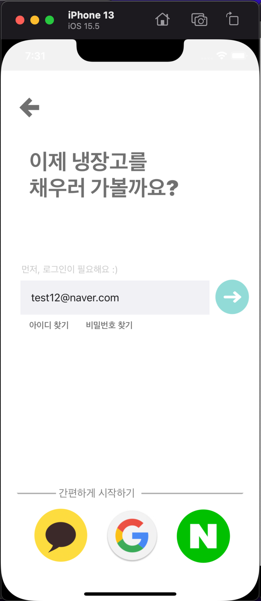
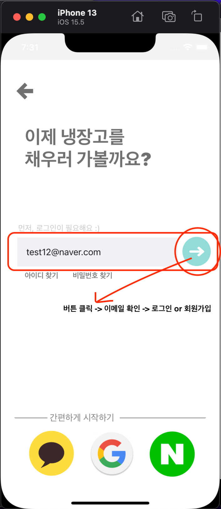

# 필요한 API 명세서

## - 로그인
1. **Login0.tsx**
- Walkthrough 화면 종료 -> 
    이메일 입력후 로그인/회원가입 넘어가는 화면

  
  

- **이메일 확인 API**
  - **method** : POST
  - **Parameter** : user_email
  - **result** 
    - 0 | `"Login"` : 로그인
    - 1 | `"Signup"` : 회원가입 
    - 400 : error
  - **CRUD** : READ(조회)

## - 회원가입
1. SignUp2.tsx
   1. 닉네임 입력 화면
       - **닉네임 중복 확인 API**
         - **설명** : 유저가 입력한 닉네임(`name`)이 데이터베이스에 이미 존재하는지 중복확인하는 API
         - **method** : POST
         - **parameter** : `name`
         - **result**
           - 1 | `"OK"` : 중복 아님
           - 0 | `"NO"` : 중복
         - **CRUD** : READ(조회)

   2. 

